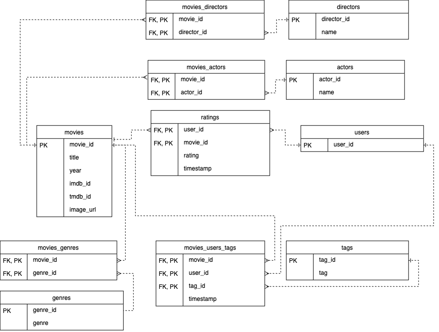

# COMP0022 Coursework

## 1 - Quick Start Guide

To run the system, follow these steps:
1. Clone this GitHub repo
2. Create a `.env` file in the root directory, based on `.env.template`
3. Run `docker compose up --build`
4. Connect to `localhost`

## 2 - Development Practices

- When making changes, please add an issue to the project in GitHub
- Allocate and progress that issue, creating a new branch with the same name
- Make changes in the new branch
- Push changes and create a pull request
- Request review of the pull request
- If the review and GitHub Actions checks pass, squash changes into a single commit with a commit name equal to the branch name

## 3 - Application Architecture

The application consists of a React frontend (`/client`), a Flask backend (`/server`), and two database instances for isolated data (`/databases/movielens` and `/databases/personality`). Further, Redis is used before querying either database. Lastly, logging and alerting are set up (`/prometheus` and `/grafana`).

The following ports are open:
- `80` - For hosting the frontend
- `5555` - For API server requests
- `3000` - For the Grafana dashboard

All configuration is managed through Docker Compose. Any relevant passwords are defined in `.env.template`.

## 4 - Database Documentation

The movielens database has the following tables:

- movies
- users
- ratings
- tags
- genres
- actors
- directors
- movies_directors
- movies_actors
- movies_genres
- movies_users_tags

The personality database has the following tables:

- users
- movies
- ratings
- genres
- movie_genre

## 5 - API Documentation

See [the docs](serverDocs.md), or go to `http://localhost:5555/apidocs` if the application is running.
